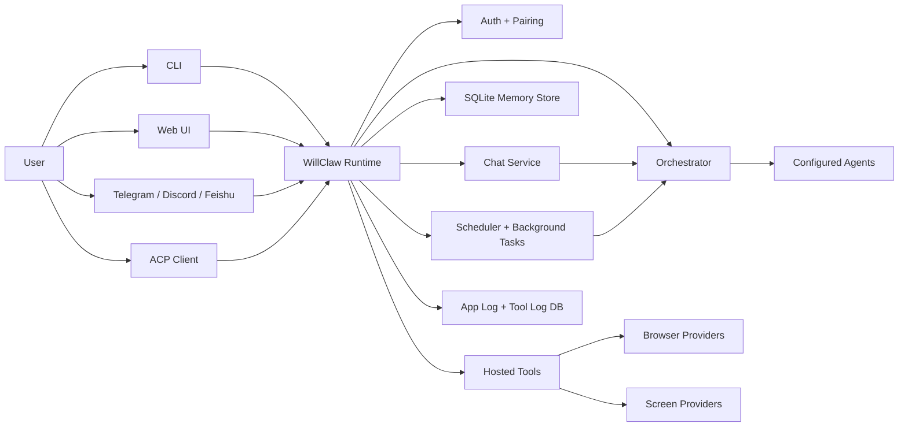
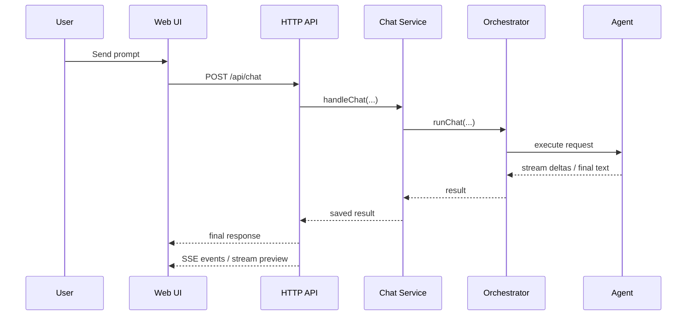

# Architecture

This document describes how the major runtime pieces fit together.

## High-Level Picture

## Repository Layers

### `packages/core`

The core runtime owns:

- config loading and path normalization
- auth and pairing
- prompt assembly
- agent backend creation
- routing
- chat handling
- persistence
- hosted tools
- HTTP server
- channel adapters
- scheduler and maintenance

### `packages/cli`

The CLI is a thin operational wrapper over the core runtime. It provides:

- `init`
- `start`
- `status`
- `agents`
- `doctor`
- `logs`
- `pair`
- `launch-agent`
- `sync-skills`

### `packages/web`

The React UI is built to static assets and served by the core HTTP server.

Its main responsibilities are:

- unlock and auth state
- chat threads and composer
- explicit agent selection and route preview
- run streaming and activity display
- inspector panels for runtime state, auth, pairing, tools, memory, and logs

## Runtime Startup Sequence

At a high level, startup does this:

1. load config and normalize paths
2. sync workspace bootstrap files
3. sync generated workspace skills
4. initialize logging
5. create event hub
6. create prompt assembler
7. create agent backends
8. initialize memory store and tool logger
9. initialize shell, filesystem, browser, and screen tools
10. initialize auth and pairing
11. create history exporter and completion monitor
12. create workspace memory manager
13. create log maintenance manager
14. create memory search service
15. create orchestrator
16. create chat service
17. create background task engine
18. create scheduler
19. create channel manager
20. optionally reindex workspace memory

## Prompt Assembly

WillClaw builds prompts from Markdown files in the workspace.

Built-in bootstrap files include:

- `IDENTITY.md`
- `AGENTS.md`
- `RULES.md`
- `WORK_MODES.md`
- `MEMORY.md`
- `HEARTBEAT.md`
- `PROJECT_HEARTBEAT.md`
- generated skill files and indexes

Rules:

- some files are always included
- some only appear for private chat or heartbeat contexts
- extra Markdown may be appended through `workspace.include_files`
- prompt character budgets are enforced

This design makes runtime behavior editable without changing TypeScript code.

## Orchestrator

The orchestrator is the routing and execution layer between a user request and a backend.

Responsibilities:

- explicit agent selection
- heuristic route selection when agent is not explicit
- tool-policy-aware prompt shaping
- hosted browser/screen action bridge instructions
- memory search bridge instructions
- fallback attempts when allowed
- streaming partial output back to callers

Route classes:

- `explicit`
- `mode_hint`
- `hosted_tools`
- `long_context`
- `read_only_coding`
- `coding`
- `simple_qa`

## Chat Service

The chat service owns request lifecycle.

Typical flow:

1. persist the user message
2. queue work per chat
3. ask the orchestrator to execute
4. persist assistant output
5. persist run metadata
6. emit realtime events
7. update history exports

It also supports:

- cancel active runs
- revoke messages
- edit and resend flows
- queued execution per thread

## Persistence Model

WillClaw persists runtime data in multiple layers:

- SQLite:
  - messages
  - command runs
  - indexed files
  - FTS-backed search state
- text files:
  - app log
  - history exports
  - workspace memory docs
- SQLite tool log DB:
  - hosted tool audit records

SQLite is the operational source of truth. Markdown exports are for human consumption.

## Hosted Tool Model

Hosted tools are WillClaw-owned machine actions, not generic backend capabilities.

Tool families:

- shell
- filesystem
- browser
- screen
- memory search

Important design rule:

- if an agent already has a strong native version of a tool, prefer that and do not duplicate it with a hosted copy

## Browser And Screen Providers

Browser:

- preferred: `agent-browser`
- coarse fallback: `system-open`

Screen:

- preferred: `peekaboo`
- coarse fallback: `screencapture`

Provider health is checked separately from route selection so the UI and runtime can expose only healthy configured actions.

## Web UI Data Flow

## Scheduler And Background Tasks

The scheduler owns recurring work such as:

- heartbeat prompts
- named cron tasks
- daily note generation
- MEMORY compaction
- log retention

Tasks can:

- run on schedule
- be triggered manually from the API or Web UI
- optionally notify configured channels

## Channel Adapters

Channels are gateway adapters that reuse the same core runtime.

Shared principles:

- access control before model work
- one broken channel should not crash the whole runtime
- per-chat queueing still applies
- channel commands are normalized through a shared shell-command layer

## ACP Server

The ACP server is optional and runs separately from the main Web server.

It exposes:

- agent listing
- sync runs
- streaming runs
- async runs
- cancellation

It uses bearer-token auth with the `acp` scope.

## Design Philosophy

WillClaw stays intentionally opinionated:

- keep the core small
- prefer agent-native abilities first
- keep hosted actions auditable
- expose machine-local power carefully
- make routing understandable rather than magical
