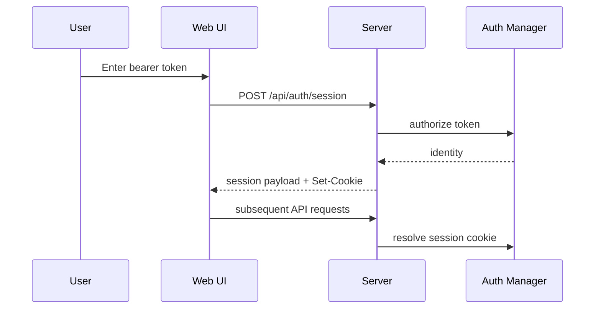

# Authentication And Pairing

WillClaw has a shared auth layer used by:

- the main HTTP API
- the Web UI
- the ACP server

It also has a pairing layer used for:

- one-time Web login codes
- one-time channel onboarding codes

## Auth Model

WillClaw auth is token-based.

Token sources:

- `server.auth_token`
- `server.auth.tokens`
- managed tokens created through the API or Web UI

Sessions:

- the Web UI can upgrade a bearer token into an HttpOnly session cookie
- sessions live in memory
- session TTL is controlled by `server.auth.session.ttl_hours`

## When Auth Is Enabled

Auth only becomes mandatory when WillClaw sees at least one valid token.

If no tokens are configured:

- Web UI is open
- API auth is effectively bypassed
- session management is not meaningful

If tokens exist:

- API routes require scope-appropriate authorization
- Web UI shows an unlock screen
- ACP requires the `acp` scope

## Auth Scopes

Supported scopes:

- `api:read`
- `api:write`
- `api:tools`
- `api:events`
- `api:session`
- `acp`

### Scope Guidance

For a full-admin local token, all scopes are reasonable.

For restricted use:

- Web shell login needs `api:session`
- read-only dashboards need `api:read`
- submitting prompts needs `api:write`
- SSE clients need `api:events`
- host-lab style tool use needs `api:tools`
- ACP clients need `acp`

## Web Login Flow



Important behavior:

- the unlock screen accepts bearer tokens
- if pairing is enabled, it can also accept pairing codes
- session cookies are HttpOnly
- logout clears the session cookie

## Managed Tokens

Managed tokens are bearer tokens created at runtime and stored hashed at rest.

Key properties:

- only returned in plaintext at creation time
- can be revoked later
- visible through auth management APIs and the Web inspector

Why they exist:

- you may want a stable local auth system without editing static YAML tokens
- you may want tokens with narrower scopes

## Sessions

The auth layer can list and revoke active sessions.

Important constraints:

- sessions are in-memory, not persisted
- restarting the process clears active sessions
- managed tokens survive restarts because they are stored on disk

## Pairing Model

Pairing invites are one-time or limited-use codes for onboarding.

Invite kinds:

- `web`
- `channel`

Stored state includes:

- invite id
- hashed code
- kind
- scopes or channels
- expiry
- usage count
- active or revoked state

Pairing data is persisted in:

- `server.auth.pairing.store_file`

## Web Pairing

Web pairing codes allow unlocking the browser shell without handing around a full bearer token.

Example:

```bash
willclaw pair create --kind web
```

Flow:

1. admin creates invite
2. user enters code in unlock screen
3. server redeems invite
4. server mints a session
5. UI proceeds with cookie auth

## Channel Pairing

Channel pairing is intended for new users in Telegram, Discord, or Feishu.

Example:

```bash
willclaw pair create --kind channel --channel telegram
```

Then in the channel:

```text
/pair wc_pair_...
```

After successful pairing:

- the channel user is granted access for that channel
- future messages can pass access control without static allowlist edits

## Pairing Safety Rules

Current intended semantics:

- pairing can be globally disabled
- disabled pairing blocks Web redeem, invite creation, and channel `/pair`
- codes expire and can have max-use limits
- codes are hashed at rest

## Operational Commands

Create invite:

```bash
willclaw pair create --kind web
willclaw pair create --kind channel --channel discord
```

List invites:

```bash
willclaw pair list
```

List grants:

```bash
willclaw pair grants
```

Revoke invite:

```bash
willclaw pair revoke-invite <inviteId>
```

Revoke grant:

```bash
willclaw pair revoke-grant <grantId>
```

## Recommended Local Setup

For a personal local machine:

1. keep `server.host` on `127.0.0.1`
2. set a strong `WILLCLAW_AUTH_TOKEN`
3. enable pairing
4. use pairing for browser unlock rather than reusing the raw bearer token constantly

## Common Problems

### The Web UI never asks me to log in

Likely causes:

- no auth tokens are configured
- `WILLCLAW_AUTH_TOKEN` is missing or unresolved

### Pairing code says invalid

Check:

- invite is not expired
- invite was not already used up
- pairing is still enabled
- the invite kind matches the flow you are using

### Session disappears after restart

That is expected. Sessions are in-memory. Use bearer tokens or pairing to create a new session after restart.
